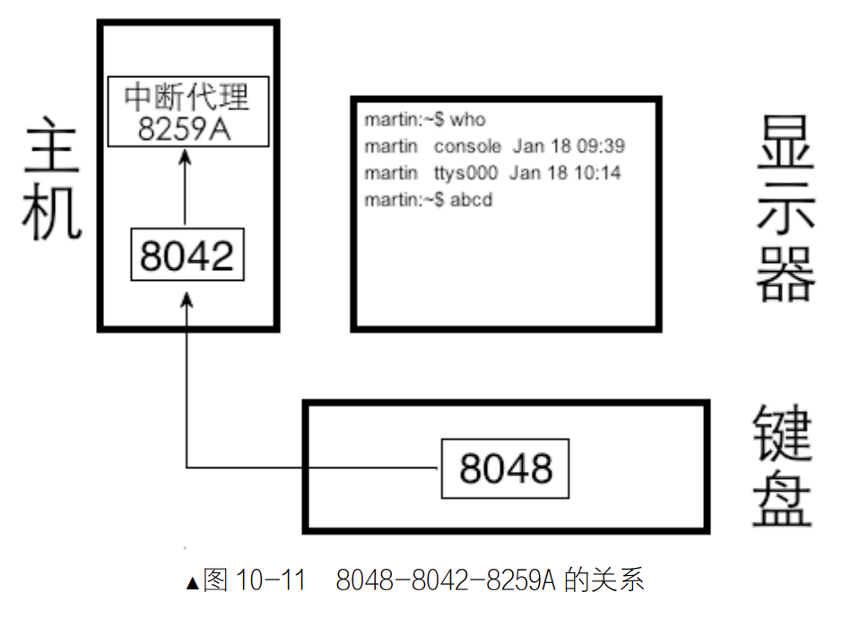
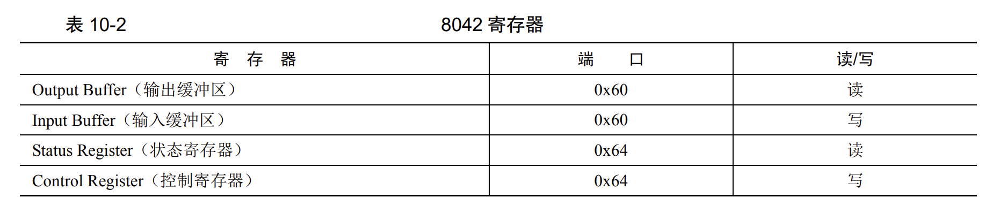

## 输入输出系统
### 锁
文章一开始解决问题用的是关中断的方式，因为调度是通过时钟中断完成的，  
本OS使用信号量实现锁，见代码**001/thread/**  
### 虚拟终端
虚拟终端(tty)，多个虚拟终端共用同一个显示器，是因为使用显存的不同区域。
Linux中共有7个界面，1个是图形界面，其他都是纯文本，通过Alt+Fx切换。每次切换就是改变显存的两个寄存器中的地址。利用远程ssh连接的终端称为pts。本地是tty。使用`who`命令显示  
在本书中只有一个终端，利用锁可以保证输出的整洁
见代码**002/device/**

### 从键盘获取输入
以PS/2为例。  
键盘把数据输入到主机，由两个芯片配合。在键盘内部为键盘编码器（Intel 8048），作用是当键盘发生按键操作时，告知键盘控制器（在主板上，Intel 8042）哪个键被按下或弹起。  
键盘控制器（在主板上，Intel 8042）作用：接受键盘编码器的按键信息，将其解码后保存，然后向8259A发中断。它们的关系如图。

每个按键都有对应的编码数值，这被称为键盘扫描码。一个键有按下和弹起两个编码。其中被按下时的编码叫通码，被松开弹起时的叫做断码。  
根据不同的编码方案，共有三套，其中最常用的是第2套（scan code set 2），本书中将第2套中通码和断码关系解码后，转换成第一套扫描码交给8042处理。
第一套扫描码中：断码 = 0x80 + 通码  
总结：

+ 扫描码有 3 套，现在一般键盘中的 8048 芯片支持的是第二套扫描码。因此每当有击键发生时，8048发给 8042 的都是第二套键盘扫描码。
+ 8042 为了兼容性，将接收到的第二套键盘扫描码转换成第一套扫描码。8042 是按字节来处理的，每处理一个字节的扫描码后，将其存储到自己的输出缓冲区寄存器。
+ 然后向中断代理 8059A 发中断信号，这样我们的键盘中断处理程序通过读取 8042 的输出缓冲区寄存器，会获得第一套键盘扫描码。

### 8042
8042共有4个8位寄存器。  
  
当处理器把对8048的控制命令临时放在8042的寄存器中，8042把控制命令发送给8048，此时8042作为输入缓冲区。  
当8048把结果提交到8042时，8042作为输出缓冲区。  
当需要把数据从处理器发到8042时，0x60作为输入，使用out指令。  
当从8048发到8042，0x60作为输出，使用in指令。  
状态寄存器作用：

+ 位0：1表示输出缓冲寄存器已满，使用in后自动置0
+ 位1：1表示输入缓冲寄存器已满，8042读取后自动置0
+ 位2：加电时置0，自检通过后置1
+ 位3：置1表示输入缓冲区中的为命令，置0表示数据
+ 位4：置1表示键盘启用
+ 位5：置1表示发送超时
+ 位6：置1表示接受超时
+ 位7：表示来自8048的数据在奇偶检验位出错

控制寄存器作用：

+ 位0：置1时启用键盘中断
+ 位1：置1时启用鼠标中断
+ 位2：设置状态寄存器的位2
+ 位3：置1时，状态寄存器的位4无效
+ 位4：置1时禁止键盘
+ 位5：置1时禁止鼠标
+ 位6：置1时将第2套键盘扫描码转换为第一套键盘扫描码
+ 位7：保留位，默认为0

每个字节都会产生一次中断

---

### 键盘中断实现

见代码**003/kernel/interrupt**  
见代码**003/device/keyboard***

### 编写键盘驱动
直接和硬件打交道的程序被称为驱动。  
处理扫描码分两种情况：

+ 与字符无直接关系的如shift，直接处理
+ 可见字符和backspace等键，交给put_char

见代码**004**

---

### 环形缓冲区
为了后面用于shell命令处理，要将输入的多个字符存在一个缓冲区中，用于解析。  
见代码**005**

