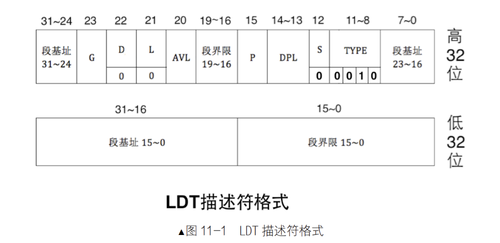
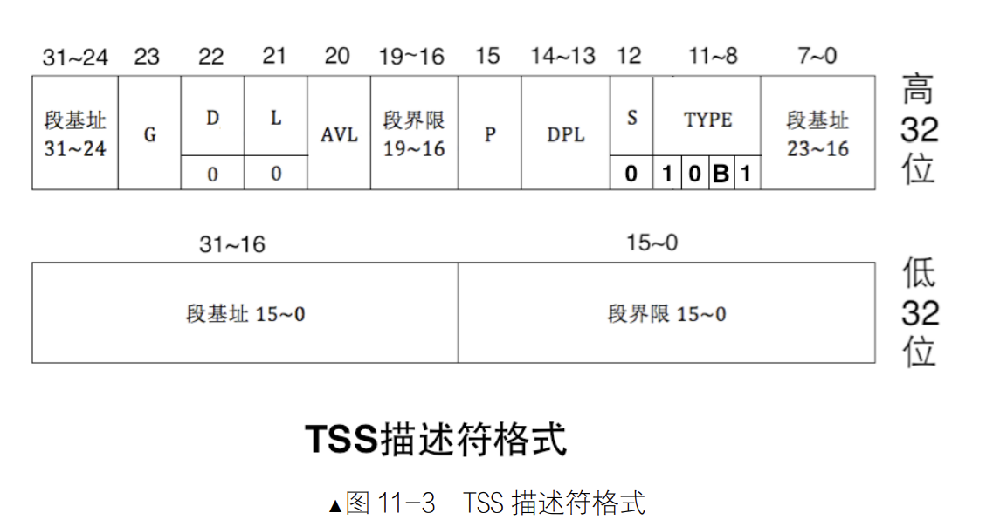

## 用户进程
### LDT
硬件实现多任务  
LDT用于每个任务存储其私有的资源  

将LDT加载的指令`lldt`  
在选择子中第2位TI用于指定是GDT索引段描述符（0）还是LDT索引段描述符（1），因此LDT的第0个描述符可用，因为TI为1，不存在未初始化现象。  
每次切换任务都需要重新加载LDT到LDTR寄存器中（平坦模式下已经不用了）
### TSS
任务切换就是切换TSS  
TSS在GDT中注册

  
B位表示任务繁忙（1），一方面指此任务是否为当前CPU上运行的任务，另一方面指此任务嵌套调用了新任务。由CPU指定。  
B位可以用于防止任务调用自己，任务嵌套还会影响eflags中的NT（Nested Task）  
TSS结构图  [TSS](../chapter5/README.md#特权级)  
TSS必须在GDT中注册，加载命令`ltr`  
TR 寄存器中存储的是 TSS 的选择子，LDTR 寄存器中存储的是 LDT 的选择子  
**CPU原生支持的任务切换（跳过）**  

---
### 现代OS的切换方式
尽管 CPU 提供了 0、1、2、3 共 4 个特权级，但我们效仿 Linux 只用其中的 2 个，内核处理特权级 0，用户进程处于特权级 3。  
使用 TSS 唯一的理由是为 0 特权级的任务提供栈。  
见代码**001**

### 实现用户进程
进程与内核线程最大的区别是进程有单独的 4GB 空间，这指的是虚拟地址，需要单独为每个进程维护一个虚拟地址池
见代码**002/thread.h**  
页表虽然用于管理内存，但它本身也要用内存来存储，所以要为每个进程单独申请存储页目录项及页表项的虚拟内存页。  
大多数情况下，用户进程在特权级 3 下工作，因此还要为用户进程创建在 3 特权级的栈。  
见代码**002/memory.c**
