## 保护模式进阶
### 获取内存
通过0x15号BIOS中断实现，分别有三个子功能，子功能号放在EAX（AX）中，注意BIOS中断在实模式下，以下只能在实模式中进行

+ eax=0xe820：获取所有物理内存
+ ax=0xe801：检测低15MB和16MB~4GB
+ ah：最多检测64MB

---

### 0xe820

ARDS结构

|  字节偏移量 | 名称  | 描述  |
|---|---|---|
|  0 |  BaseAddrLow | 基地址的低32位  |
| 4  | BaseAddrHigh  | 基地址的高32位  |
| 8  |  LengthLow | 内存长度的低32位，字节为单位  |
| 12  |  LengthHigh | 内存长度的高32位，字节为单位  |
| 16  |  Type | 本段内存类型  |

每次int0x15都会返回一个这种结构  
Type字段具体含义

|  值 | 描述  |
|---|---|
| 1  | 这段内存可以被操作系统使用  |
| 2 | 内存使用中或者系统保留，os无法使用  |
|  其他 | 未定义  |

调用0xe820需要的参数及其含义

|  寄存器 | 用法  |
|---|---|
| EAX  | 固定输入0xe820  |
| EBX | 使用前必须置为0，该值为当前的ARDS下标  |
|  ES:DI | 该值指向的内存为ARDS结构中的值  |
|  ECX | ARDS结构的大小，固定为20字节  |
|  EDX | 签名标记，固定为0x534d4150  |

返回0xe820中寄存器或标志位含义

|  寄存器或标志 | 用法  |
|---|---|
| CF  | 0表示没出错，1表示出错  |
| EAX | 固定为0x534d4150  |
|  ES:DI | 该值指向的内存为ARDS结构中的值  |
|  ECX | ARDS结构的大小，固定为20字节  |
|  EBX | 下一个ARDS，若返回后为0，那么检测结束  |

注意：在赋值时，EBX、EDX、DI只用赋值一次，其他每次中断，都要重新赋值

---

### 0xe801

低于15MB的内存单位为1KB，高于16MB的内存单位为以64KB记录  
具体寄存器功能说明
|  寄存器或标志 | 用法  |
|---|---|
| AX（调用）  | 固定输入0xe801  |
|---|---|
| AX（返回）  | 1KB为单位，最大为0x3c00  |
| CF  | 0表示没出错，1表示出错  |
| BX | 64KB为单位  |
|  CX | 同AX  |
|  DX | 同BX  |

分为两段内存检测原因：实际物理内存和检测内存如下图
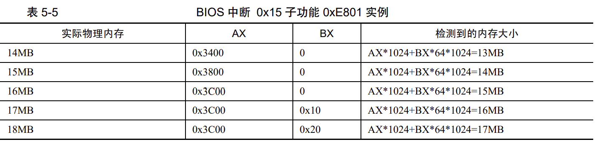
由于80286的寻址范围最大为16MB，老式ISA设备会使用15MB以上缓存区，但操作系统不可以使用这段（memory hole），实际的物理内存大小要加1MB

---

### 0xe88
此中断只会显示0~63MB，因为不包含低端1MB大小。  
具体寄存器功能说明
|  寄存器或标志 | 用法  |
|---|---|
| AH（调用）  | 固定输入0x88  |
|---|---|
| AX（返回）  | 1KB为单位，不包括低端1MB  |
| CF  | 0表示没出错，1表示出错  |

### 分页
在没有开启分页情况下，线性地址（基地址+段内偏移）= 物理地址  
页表用于存储线性地址和物理地址的映射关系，一页大小为4KB，一个页表项为4B  
页目录表用于存储页目录项（页表物理地址）  
在32位地址空间中，虚拟地址的高10位用于定位页目录项，中间10位用于定位页表项，最后12位用于页内偏移地址（用于表示4KB之内任意地址）  
注意给出PDE（页目录项）和PTE（页表项）索引后，还需要*4，因为它们都是4B大小。  
具体转换步骤：  
1. 将虚拟地址的高10位乘4，加上页目录表的物理地址，得到页目录项物理地址，页目录项里是页表的物理地址
2. 将虚拟地址的中间10位乘4，加上第一步中得到的页表物理地址，得到页表项物理地址，页表项里是分配的物理页地址
3. 虚拟地址的低12位，加上第2步得到的物理地址

页目录项
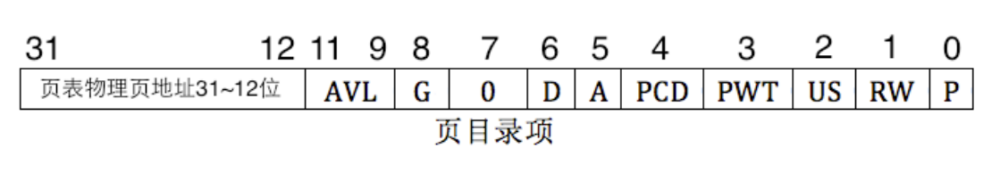
页表项
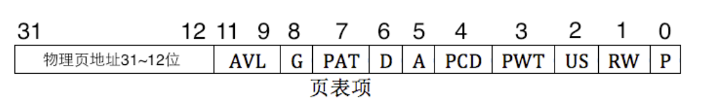
4字节大小，只有12~31为物理地址  
P，Present，存在位。若为1表示该页存在于物理内存  
RW，Read/Write，读写位，1表示可读可写，0表示不可读写  
US，User/Supervisor，普通用户/超级用户，1表示User级，任意级别可访问，0表示Supervisor级，级别为3不可访问
PWT，Page-level Write-Through，页级通写位，用时直接为0  
PCD，Page-level Cache Disabel，页级高速缓存禁止位。1表示启用高速缓存  
A，Acessed，访问位。1表示该页被CPU访问过  
D，Dirty，脏页位，对页面写时，设置为1  
PAT，Page Attribute Table，页属性表位，置为0
G，Global，全局位，1为全局页，将在TLB中一直保存  
AVL，Available，保留位，没用  

启用分页机制  

1. 准备好页目录表和页表
2. 将页目录表地址写入cr3（页目录表基址寄存器）
3. cr0的PG位置1


只用设置高20位（页目录表低12位必定为0），其他都为0  

### 准备页表

见代码002  
设置虚拟地址空间的0~3GB设置为用户进程，3GB~4GB是操作系统。  
页目录表物理地址位置：0x100000，页目录表占4KB，第一个页表物理地址为0x101000  
各个用户进程的高1GB要指向内核物理地址，即进程768（768*4MB刚好是3GB）~1022（1023指向页目录表本身）的页目录项都一样  
0x00000000～0x3fffffff 是第 1 个 1GB 内存  
0x40000000～0x7fffffff 是第 2 个 1GB 内存  
0x80000000～0xbfffffff 是第 3 个 1GB 内存  
0xc0000000～0xffffffff 是第 4 个 1GB 内存
最高位每变化4位为1GB  

对页表和页目录表是在物理地址下操作，而对gdt，栈等要修改为虚拟地址

0xffc00000～0xffc00fff -> 0x000000101000～0x000000101fff  
出现上述映射的原因：如果高10位全为1即在第1023个页目录项，即11111111110...b = 0xffc...，该目录项的高20位物理地址为0x100000,由于该地址是高10位的虚拟地址索引，因此会被当做页表的物理地址。  
此时若中间10位为0，则索引到第0个页目录项，为第一个页表物理地址，即0x101000。最终12位地址也是0，所以加上不变。最后会索引成上述这样

0xfff00000～0xfff00fff -> 0x000000101000～0x000000101fff  
出现上述映射的原因：同上0xfff会索引到第768个目录项，刚好指向第一个页表

0xfffff000～0xffffffff -> 0x000000100000～0x000000100fff 
出现上述映射的原因：0xfffff会先索引到1023个页目录项，然后又索引到1023个页目录项，最终就是页目录表的物理地址，因此访问页目录项可以使用0xfffffxxx，其中xxx是页目录表内便宜地址，刚好4KB，不用再乘4

总结：

+ 获取页目录表物理地址：0xfffff000
+ 获取页目录项物理地址：0xfffffxxx
+ 获取页表项物理地址：0x3ff（左移22位变成ffc）+ 中间10位<<12 + 低12位

### 快表
在快表中，高20位的虚拟地址对应高20位的物理地址  
TLB的更新方式交给开发者  
一种方式是重新加载CR3，一种是使用invlpg命令

### C编写内核

见003文件夹  
gcc命令  
`-c` 编译、汇编，不进行链接，生成目标文件  
`-o` 输出的文件以指定文件名存储,如果不加-c则会直接生成可执行文件  
`-S`生成汇编代码  
目标文件也称作待重定位文件，重定位指文件里面的符号没有安排地址，符号地址在与其他目标文件链接成可执行文件后进行定位  
`file xxx` 查看文件状态  
`nm xxx` 查看符号地址  
`ld 源文件 -Ttext 0xc0001500 -e main -o 生成文件` -Ttext表示起始虚拟地址，-e指定程序起始地址，默认是_start  

ELF中目标文件类型分为：待重定位文件、共享目标文件（动态链接库）、可执行文件

条目对应程序（节）头表中的一个程序（节）头里的描述信息  
ELF信息包含在/usr/include/elf.h中  
ELF由ELF Header、程序头表、节头表、ELF Sections组成  
ELF header中的数据类型  
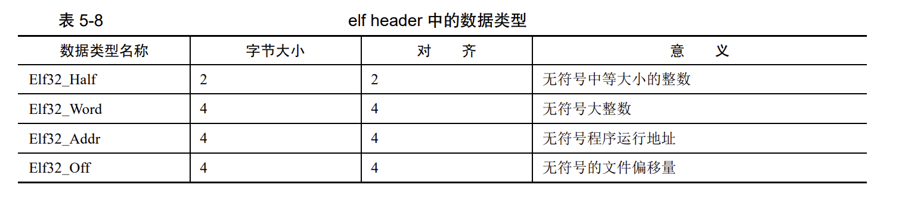
ELF header结构
```C
#define EI_NIDENT (16)

typedef struct
{
  unsigned char e_ident[EI_NIDENT];     /* Magic number and other info */
  Elf32_Half    e_type;                 /* Object file type */
  Elf32_Half    e_machine;              /* Architecture */
  Elf32_Word    e_version;              /* Object file version */
  Elf32_Addr    e_entry;                /* Entry point virtual address */
  Elf32_Off     e_phoff;                /* Program header table file offset */
  Elf32_Off     e_shoff;                /* Section header table file offset */
  Elf32_Word    e_flags;                /* Processor-specific flags */
  Elf32_Half    e_ehsize;               /* ELF header size in bytes */
  Elf32_Half    e_phentsize;            /* Program header table entry size */
  Elf32_Half    e_phnum;                /* Program header table entry count */
  Elf32_Half    e_shentsize;            /* Section header table entry size */
  Elf32_Half    e_shnum;                /* Section header table entry count */
  Elf32_Half    e_shstrndx;             /* Section header string table index */
} Elf32_Ehdr;
```
解释：

+ 前四个字节为固定值：e_ident[0] = 0x7f,e_ident[1]='E',e_ident[2]='L',e_ident[3]='F'
+ e_ident[4] 用于表示elf文件类型，0为不可识别，1为32位elf，2为64位elf
+ e_ident[5] 编码格式，0为非法，1为小端，2为大端
+ e_ident[6] 版本信息，默认为1，0为非法
+ e_ident[7~15] 保留位，默认为0
+ e_type指定文件类型,下图为具体取值

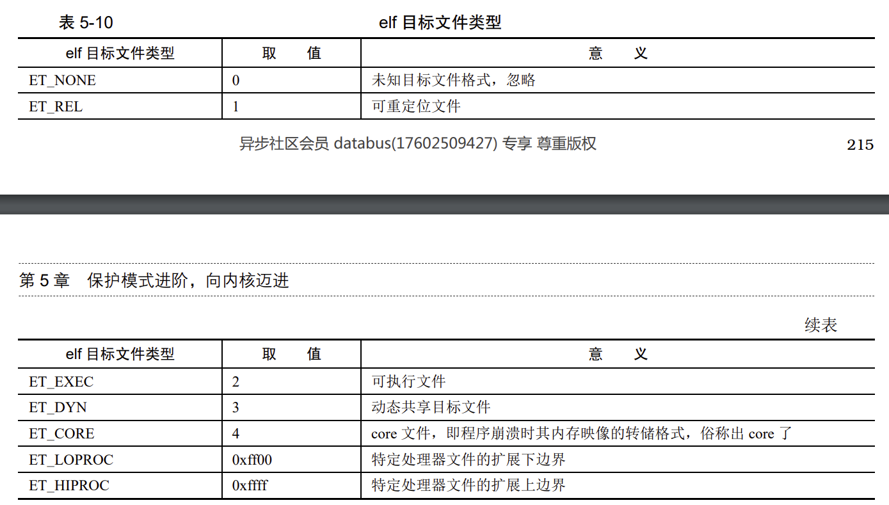

+ e_machine指明可运行的硬件平台

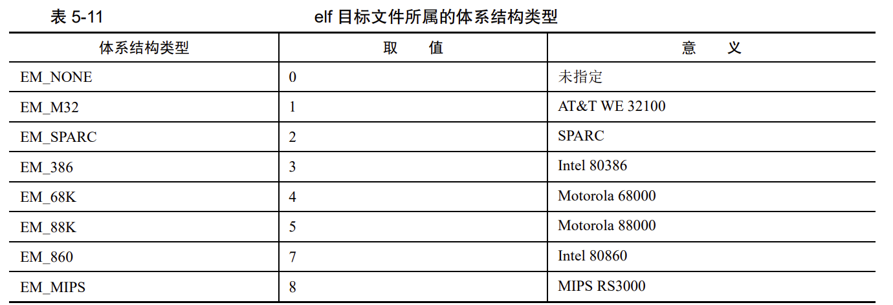

+ 剩余直接看注释

程序头表的结构，用于描述磁盘上的程序中的一个段

```C
typedef struct
{
  Elf32_Word    p_type;                 /* Segment type */
  Elf32_Off     p_offset;               /* Segment file offset */
  Elf32_Addr    p_vaddr;                /* Segment virtual address */
  Elf32_Addr    p_paddr;                /* Segment physical address */
  Elf32_Word    p_filesz;               /* Segment size in file */
  Elf32_Word    p_memsz;                /* Segment size in memory */
  Elf32_Word    p_flags;                /* Segment flags */
  Elf32_Word    p_align;                /* Segment alignment */
} Elf32_Phdr;
```
解释：

+ p_type指明程序中该段类型
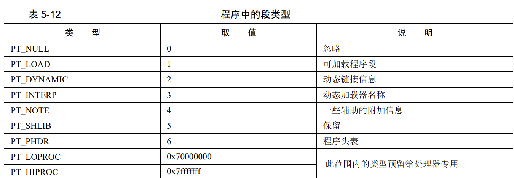
+ p_flags指明该段权限
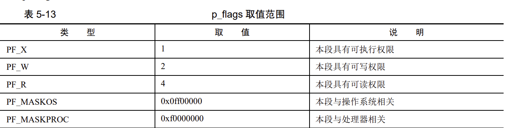
+ p_align对齐方式，0或1表示不对齐
### 举个栗子
见004文件夹，使用./xxd.sh kernel.bin 0 300 本次使用的是书中的结果
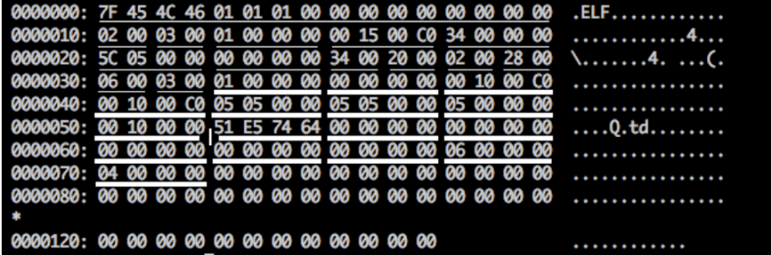
第1行：7F 45 4C 46为固定值。01 01 01表示32位，小端，版本。  
第2行：00 02 表示可执行文件。00 30 表示80386 。00 00 00 01表示版本。C0 00 15 00 表示入口地址。00 00 00 34 程序头表偏移地址。  
第3行：00 00 05 5c 节头表偏移地址。00 00 00 00表示eflags。00 34表示 elf header大小。00 20。表示程序头大小。00 02表示段个数。00 28表示各个节大小。  
第4行：00 06表示节的个数。 00 03表示索引为3  
程序头表共有2个段，每个段大小为0x20字节，使用竖线区分，接下来是Elf32_Phdr。  
00 00 00 01表示PT_LOAD类型。00 00 00 00表示本段在文件内偏移量。00 00 10 00表示本段加载到内存的虚拟地址。00 01 00 00保留项。00 00 05 05表示本段在文件中字节大小。00 00 05 05 表示本段在内存中字节大小。00 00 00 05表示执行权限。00 00 10 00表示对齐方式  
简单方式：`readelf -e kernel.bin`

### 加载内核
内核被放在低端1MB区域，目前使用如图所示。
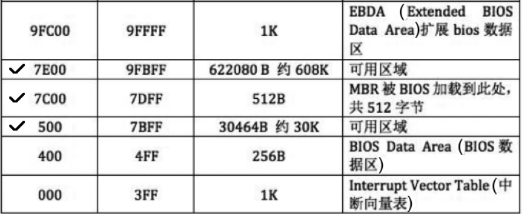
kernel.bin放在0x70000位置,具体代码见**005/load.S**文件夹  
首先将kernel.bin从硬盘读入到内存的0x70000处（物理地址）  
准备工作，为了复制内核的物理地址到虚拟地址，elf头需要使用

+ e_phentsize(dx)，程序头大小
+ e_phoff(ebx)，第一个程序头在文件的偏移量
+ e_phnum(cx)，程序头数量

之后指定物理地址，循环遍历每一个程序头，若为0，则跳过，否则开始复制需要使用ph头  
memcpy(dst,src,size)，使用栈存储，从右往左压栈

+ p_filesz(size)
+ p_offset(src)，这里看下源码
+ p_vaddr(dst)

注意源码中是从[ebp + 8]开始寻找参数，因为提前压入了0x00000000（还不知道为啥有）和函数的返回地址  
字符串搬运：movsb、movsw、movsd，每次复制1、2、4字节，将DS:SI的值复制到ES:DI，ecx控制次数，cld将eflags中DF置为0，每次地址增加；std将DF置为1，每次地址减少。rep指令开始启动  
最后修改esp的值为 0xc009f000，并跳转到 0xc0001500

### 特权级
特权级分为0、1、2、3级，其中3级最低  
处理器在不同特权级下，使用不同的栈   
任务状态段（TSS）

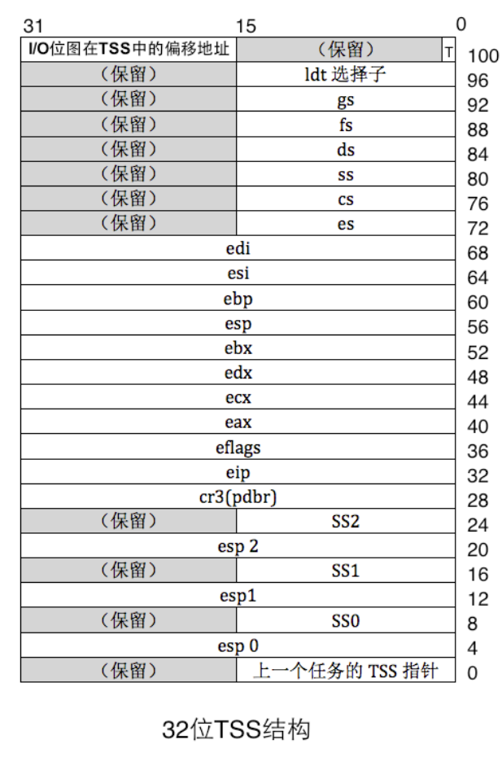  
TSS使用TR寄存器加载  
SS2、SS1、SS0表示三个栈  
特权级转移分为两类，一类是由中断门等实现低->高，一类使用返回指令实现高->低（唯一方法） 
当寻找更高级时就从TSS中寻找，3级最低，因此不用记录  
当从高到低，会将低特权级的栈记录在高特权级栈中，使用retf再弹出
### CPL、DPL
请求特权级（RPL）位于段选择子的0~1位，使用段选择子时带上RPL的特权级。  
当前特权级（CPL）是CPU当前所处的特权级，即代码段描述符中的描述符特权级（DPL）  
DPL或者CPL保存在CS.RPL中  
受访者为数据段：访问者权限大于等于段的DPL  
受访者为代码段：访问者权限等于段的DPL（中断例外）  
那如何使用高级别代码段：
+ 一致性代码段
+ 使用门。  

在段描述符中，段为非系统段（S=0），type中的C=1表示该段为一致性代码段，则可以转移。代码段有一致性和非一致性，数据段都为非一致性   
一致性代码段特点：转移后的特权级不是当前代码段的DPL，而是转移前的代码段，CPL并没有提升。  
门用于记录一段程序的起始地址  
任务门描述符
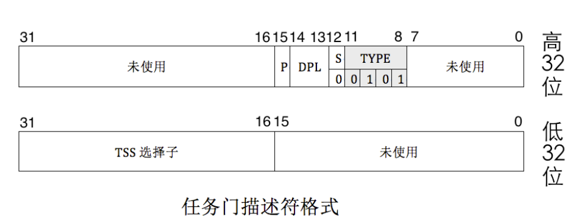

不用

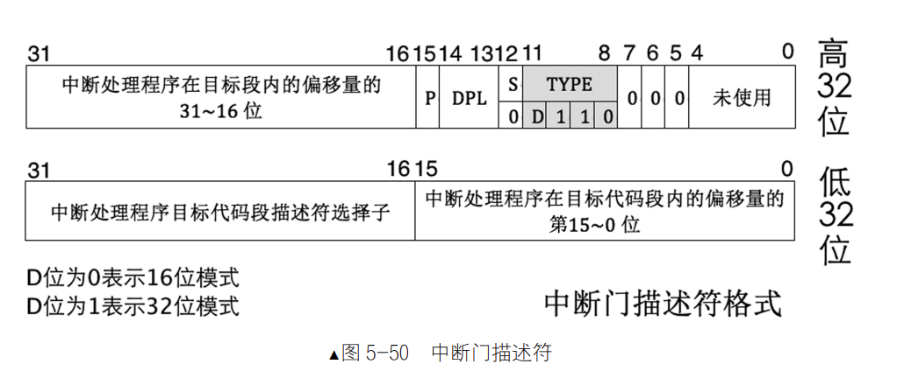

int实现低->高

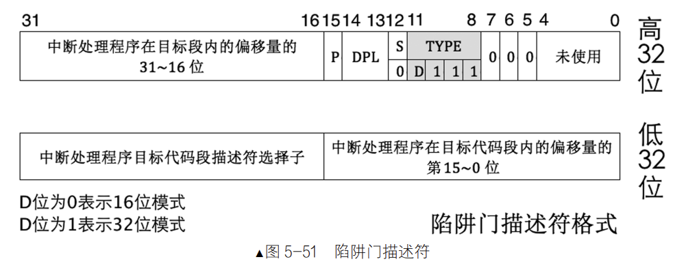

int3实现低->高

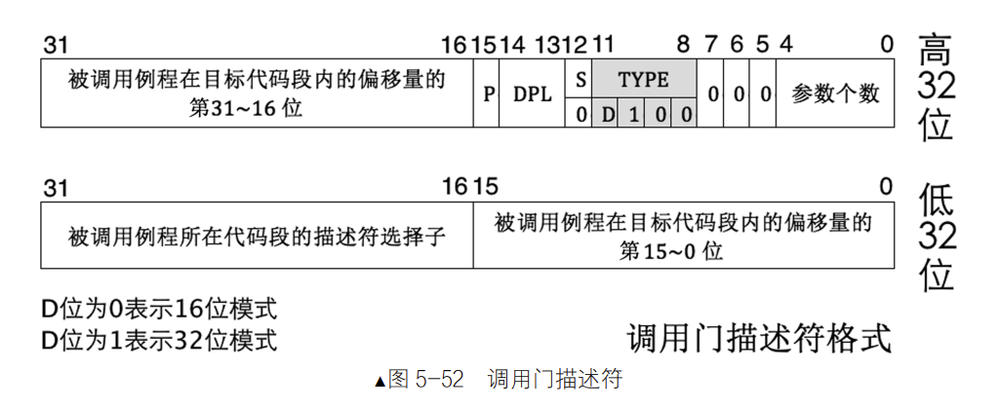

调用门在多段程序下使用，但现在都是平坦模型，已经不用了，call或者jmp实现低->高。  
调用门一般用来实现系统调用，现在都是用中断门实现。  
任务门描述符可以放在 GDT、LDT 和 IDT，中，调用门可以位于 GDT、LDT 中，中断门和陷阱门仅位于 IDT 中。  
任务门和调用门使用call，jmp调用，中断门和陷阱门使用中断信号  
CPL的特权级要大于等于门的DPL（不然进不去），CPL的特权级要小于等于门内的代码的DPL（如果特权级比你低了那没必要）  
使用调用门提升特权级：

1. 首先在特权级栈中压入参数
2. 处理器在TSS中找到新的特权级栈的SS和ESP
3. 检查新栈段选择子描述符的Type和DPL
4. 如果DPL特权级更高，那么栈要更改，原先栈的SS和EP先临时保存，变为新的SS和EP后，再将临时保存的旧的SS和EP压入新的栈中。如果平级不会更新栈
5. 复制压入的参数到新栈
6. 由于调用门描述符的使用，段描述符缓冲寄存器会被刷新，因此CS和EIP也要保存在新栈中，如图所示。旧的CS为16位，因此使用0填充
7. 把门描述符的选择子加载到CS、偏移量加载到EIP 
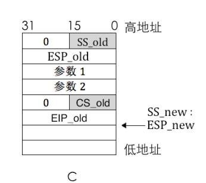

使用retf返回：

1. 首先检查CS中的RPL，是否要改变特权级
2. 弹出CS和EIP
3. 根据参数数量，将栈指针指向ESP_old
4. 如果需要改变特权级，则弹出ESP和SS

如果返回后DS、ES、FS、GS中的特权级更高，那么将会被清0，防止特权级低的程序能访问，利用选择子指向第0个描述符触发异常。

---

### RPL
RPL代表真正请求资源的特权级，因此在请求资源时必须同时满足RPL和CPL特权级大于目标的DPL。注意：RPL在段选择子中，DPL在段描述符中。  
为防止伪造，操作系统会将RPL改为用户的CPL。arpl用于修改RPL。在比较时RPL和CPL都很重要   
对于门需要满足：

+ CPL的特权级要大于等于门的DPL，CPL的特权级要小于等于门内的代码的DPL。
+ RPL的特权级要大于等于门的DPL

---

### IO特权级
IO特权级有eflags中的IOPL和TSS中的IO位图指定，只有IO特权级大于等于IOPL才能执行。  
每个任务都有自己的eflags，因此每个任务可以指定当前任务对所有IO指定的最低特权级。当IO特权级小于IOPL时，可以使用TSS的IO位图来开启指定端口，总共有65536端口，使用位图则是8KB大小，当为0时可以访问，1时不可访问。  
当不包括IO位图时，TSS大小为104字节，若包括则是+8192+1（0xff）  
最后一个字节为0xff原因：  
对一个端口读写多个字节时，实际上是对从该端口的起始，连续读多个端口。当出现IO位图的最后一个bit位对应第一个端口，第2个端口就可能越界，0xff用于防止越界。


---

### 一些问题

+ 文件无法运行，可能是windows上传的，使用set ff?查看格式，使用set ff=unix改为linux能运行
+ git无法识别 loose object 查看https://stackoverflow.com/questions/4254389/git-corrupt-loose-object