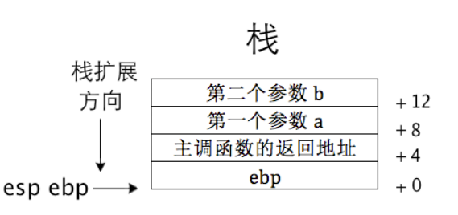

## 完善内核
### 函数调用约定
函数调用约定，主要体现在参数传递方式、参数传递顺序和寄存器保存。  
使用每个进程的栈保存参数，获取参数使用偏移量在栈中寻找  
C语言的调用约定（cdecl）：由调用者清理，函数参数从右到左入栈。其中EAX、ECX和EDX寄存器由调用者保存，其余的寄存器由被调用者保存。函数返回值存储在EAX中。由调用者清理栈空间。

```C
int subtract(int a, int b); //被调用者
int sub = subtract (3,2); // 主调用者
```
主调用者：
```x86asm
push 2 ;压入参数 b
push 3 ;压入参数 a
call subtract ;调用函数 subtract
add esp, 8 ;回收（清理）栈空间
```
被调用者：
```x86asm
 push ebp ;压入 ebp 备份
 mov ebp,esp ;将 esp 赋值给 ebp
;用 ebp 作为基址来访问栈中参数
 mov eax,[ebp+0x8] ;偏移 8 字节处为第 1 个参数 a
 add eax,[ebp+0xc] ;偏移 0xc 字节处是第 2 个参数 b
;参数 a 和 b 相加后存入 eax
 mov esp,ebp ;为防止中间有入栈操作，用 ebp 恢复 esp
;本句在此例子中可有可无,属于通用代码
 pop ebp ;将 ebp 恢复
ret 
```
栈的情况


---

### 汇编和C混合编程
使用汇编代码和内核通信（与C函数调用有区别）。ebx、ecx、edx、esi、edi用于存储1~5个参数。若参数大于5，放入内存区域，其中区域首地址放到ebx中。
在汇编代码中导出符号使用global，引用使用extern。  
在C中导出直接位全局变量就可以，引用使用extern。

---

### 实现打印

VGA寄存器分为Address Register和Data Register。其中Address Register用于索引寄存器，Data Register用于对该索引寄存器进行输入和输出操作。  
实现打印使用CRT寄存器，其Address Register3x4h和Data Register3x5h，x的值取决于Input/Output Address Select字段，它决定映射的端口号为3B4h-3B5h或3D4h-3D5h。  
见代码001/lib/kernel/print.S  

1. （首先要用段选择子加载gs）备份寄存器现场
    
    + 使用`pushad`保存EAX、ECX、EDX、EBX、ESP、EBP、ESI、EDI，按照以上顺序入栈。 
2. 获取光标位置（bx存储位置）
    
    + 光标位置为0~1999，为了能显示光标，CRT中索引为0Eh表示光标坐标高8位，CRT索引问0Fh位光标坐标低8位。访问CRT需要先往端口地址为0x3D4的寄存器写入索引，在从0x3D5的寄存器读写数据，获取和修改光标位置。注意：8位数据只能对低8位进行操作。 

3. 获取待打印字符
4. 判断是否为控制字符，若为回车，换行，退格符则进入处理流程，否则进入输出流程

    + 换行符是0x0a，回车符是0x0d，空格是0x08，jz是je如果相等就跳转。回车效果是撤到行首，换行就是换行
    + 如果是普通字符，修改两个字节值，然后让光标位置+1，最后判断是否等于2000，若等于则需要换行
    + 如果是空格，先让光标指向前一个字符，因为光标总在字符前面，将字符变为空格
    + 如果是回车符，dx作为被除数高16位，ax作为被除数低16位，除80，得到行值（商，ax）和列值（余数，dx），最后减去余数来到行首
    + 如果是换行，在此基础上bx+80
5. 判断是否滚屏
    
    + 显存有32KB，可以存储8页字符，索引0xc的高8位和索引0xd的低8位为字符显示的起始位置，如果过大，如果起始位置过大，显卡会进行回绕，不用这个方法。两个寄存器直接默认为0
    + 将第 1～24 行的内容整块搬到第 0～23 行，也就是把第 0 行的数据覆盖。
    + 再将第24行数据用空格覆盖
    + 把光标移到第24行行首
    + 使用movsd，一次搬运4个字节，设置ecx为（2000-80）*2 /4 = 960，esi为0xb80a0，edi为0xb8000。最后将最后一行使用空格覆盖，将空表重置到1920处
6. 更新光标坐标值，使其指向下一个打印字符位置
7. 恢复寄存器现场，退出

### 实现字符串打印
见代码002/print.S

1. 首先保存寄存器ebx（字符串地址），ecx（存储字符）
2. 从栈中获取字符串地址
3. 比较字符如果为0，则结束
4. 恢复寄存器

### 实现整数打印
见代码003/print.S  
将32位的16进制整数转换为字符输出，不打印前缀0x

1. 首先使用dq申请8字节空间作为临时存储
2. ecx为8个16进制，eax为整数，edx为待打印整数，edi为7，在缓存位置中的初始偏移量，ebx为缓存的位置
3. 将每一位和0x0000000F进行与操作，比较是否大于9，若大于则先-10，再+'A'。否则直接+'0'
4. 使用大端序排列，将最低位放在最高位，每次循环右移4位eax，并赋值给edx处理
5. 当缓存中全是待打印字符，需要把为0的去掉，若全为0，就打印0，否则开始执行正常字符打印流程

### 内联汇编

采用AT&T风格


内存寻址格式base_address(offset_address,index,size)，例如movl %eax,base_value(%ebx,%esi,2) 等同于是将 eax 的值写入base_value+ebx+esi*2 所指向的内存  

内联汇编格式：asm [volatile] ("assembly code")  
volatile表示让gcc保留汇编代码原样  
扩展内联汇编格式：asm [volatile] (“assembly code”:output : input : clobber/modify)

+ output表示将汇编结果存储在C变量中
+ input表示将C中数据给汇编使用，以上两者都是C变量

把上述的C变量映射为汇编，被称作约束，约束作用域为input和output。    
寄存器约束

+ a表示寄存器eax/ax/al
+ b表示寄存器ebx~
+ c表示寄存器ecx~
+ d表示寄存器edx~
+ D表示寄存器edi/di
+ S表示寄存器esi/si
+ q表示eax/ebx/ecx/edx
+ r表示eax/ebx/ecx/edx/esi/edi
+ g表示可以放到寄存器和内存中
+ A把eax和edx组合成64位整数

内存约束

+ m表示操作数可以使用任意的内存形式
+ o操作数为内存变量，但访问它通过偏移量的形式访问

立即数约束  
由于立即数不是变量，只能作为右值，只能放在input中

+ i表示为整数立即数
+ I表示0~31的立即数
+ J表示操作数为 0～63 之间的立即数
+ N表示操作数为 0～255 之间的立即数
+ O表示操作数为 0～32 之间的立即数
+ X表示操作数为任何类型立即数

通用约束  
0～9：此约束只用在 input 部分，但表示可与 output 和 input 中第 n 个操作数用相同的寄存器或内存  

占位符分为序号占位符和名称占位符  
序号占位符  
`asm("addl %%ebx, %%eax":"=a"(out_sum):"a"(in_a),"b"(in_b));` 等同于  
`asm("addl %2, %1":"=a"(out_sum):"a"(in_a),"b"(in_b)); `  
"=a"(out_sum)序号为0，%0表示eax  
"a"(in_a)序号为1，%1表示eax  
"b"(in_b)序号为2，%2表示ebx  
为了区别占位符，需要在寄存器前面多加一个%

名称占位符
`asm("divb %[divisor];movb %%al,%[result]":[result]"=m"(out):"a"(in_a),[divisor]"m"(in_b));`
使用%[result]，[result]"=m"(out)形式  

操作数类型修饰符  
output中  

+ =：表示操作数只写，相当于为output赋值
+ +：表示可读可写，gcc中约束的寄存器或内存先被读入，再被写入
+ &表示output独占，任何input中寄存器不能与其相同

input中

+ %表示该操作数可以和下一个输入操作数互换

`+`的使用
`asm("addl %%ebx, %%eax;":"+a"(in_a):"b"(in_b));`跟原来相比少了输入的eax。  

gcc机器模式  
用于在内联汇编中更加细粒度的操作数据  
h –输出寄存器高位部分中的那一字节对应的寄存器名称，如 ah、bh、ch、dh。  
b –输出寄存器中低部分 1 字节对应的名称，如 al、bl、cl、dl。  
w –输出寄存器中大小为 2 个字节对应的部分，如 ax、bx、cx、dx。  
k –输出寄存器的四字节部分，如 eax、ebx、ecx、edx。


