## 中断
### 中断分类
+ 外部中断（硬件中断）
    
    + 可屏蔽中断
    + 不可屏蔽中断
+ 内部中断

    + 软中断
    + 异常 

---

### 外部中断

使用信号线INTR（INTeRrupt）和NMI（Non Maskable Interrupt）通知CPU  
INTR和NMI区别  
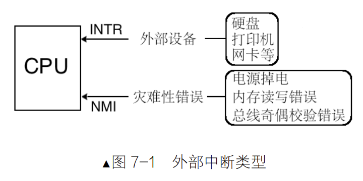
INTR属于可屏蔽中断，可以通过设置eflags中的IF位屏蔽。而NMI不行，不可屏蔽中断的中断向量号为2  
中断程序分为上半部分和下半部分。其中上半部分为需要立即执行，属于关中断状态，下半部分属于开中断，可以稍后执行

---

### 内部中断

软中断：由软件主动发起的中断  

+ int 0~255
+ int3 触发中断向量号为3，为调试指令，机器码为0xcc 
    
    + 原理为：调试器将被调试的进程断点起始地址的第1字节备份后，原地修改为0xcc。当执行到0xcc时，触发中断。当中断发生时，会在栈中保存上下文，通过查看此时栈的上下文，从而获得寄存器，内存单元的情况。

+ into 中断向量号为4，溢出指令，查看OF位为1是触发
+ bound 检查数组是否越界，中断向量号为5
+ ud2 未定义指令，中断向量号为6，用于软件测试  

上面几种除了int 0~255外，都可被成为异常。

异常： CPU内部错误引起  
可以无视IF位的中断类型：NMI和内部中断  
异常分类

+ Fault：如Page Fault
+ Trap：int3
+ Abort

总结：异常和不可屏蔽中断的中断向量号由CPU提供，可屏蔽中断由中断代理8259A提供，软中断由软件提供。

---

### 中断描述符表（IDT）

中断描述符为8字节，具体结构如下
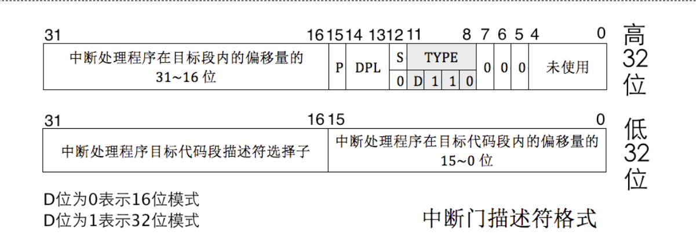
在使用中断描述符进入中断，会将IF置为0，关中断  
IDT的位置可以在内存任意地方，找寻方式使用中断描述表寄存器（IDTR）  
IDTR长度为48位，6字节，其中低16位表示界限（0~0xffff，64KB），高32位表示基地址，但只支持0~255中断号，其中0号为除法错  
加载IDTR指令为：lidt

### 中断处理过程
对于CPU内：

1. 根据中断向量表定义中断描述符
2. 处理器进行特权级检查
    
    + 中断向量号是整数，不涉及RPL，如果由软中断发起，检查CPL要在门描述符DPL和门中目标代码段之间
    + 但若是外部设备和异常引起，只检查CPL和目标代码段
3. 执行中断处理程序

中断发生后，eflags的NT位和TF位被置为0，如果中断对应的门是中断门，IF位也是0，避免中断嵌套。如果是任务门或者陷阱门就不会  
中断结束使用iret指令返回  
`cli`可以手动关中断  
`sti`可以手动开中断  
中断相关标志位

+ IF只能限制外部设备中断，异常，软中断，int n，NMI都无法限制
+ TF（Trap Flags）陷阱标志位，用于调试，进入中断后，置为0表示不允许中断程序单步执行。
+ NT（Nest Task Flag）任务嵌套标志位，在执行新任务前，CPU将旧任务选择子写到新任务TSS中的"上一个任务TSS的指针"，并且NT置为1。当iret时，检查NT，若为1表示任务嵌套，会从"上一个任务TSS的指针"获取，如果是为0，表示在中断处理环境，执行正常的中断退出。

如果中断发生特权级转移，新栈情况如下
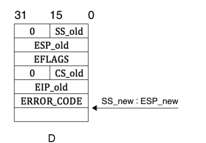  
与第5章调用门相比，多了eflags和错误码，错误码一般位中断向量号0~32  
中断返回依然使用iret，同第5章相同，但错误码必须手动跳过。[chapter5](../chapter5/README.md)

---

### 中断错误码
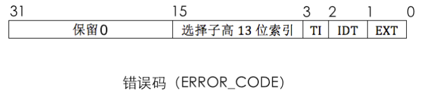
EXT表示中断源是否来自外部，若是为1  
IDT表示选择子是否指向中断描述符表IDT，IDT为1指向，否则指向GDT或者LDT  
TI为0从GDT中找描述符，为1从LDT中找  
高13位表示索引描述符下标  
如果低16位也是0，表示中断的发生与特定段无关，或者引用了一个空描述符。

### 可编程中断控制器8259A
Intel共支持256个中断，但8259A只管理8个中断，通过级联进行扩展，n片级联可以支持7n+1个，最多有9个。  
级联时只能有1片8259A为主片，其余的为从片。来自从片的中断只能传给主片，再由主片传给CPU  
级联示意图 
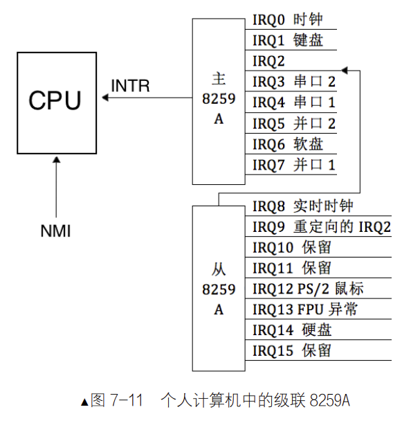  

芯片内部结构
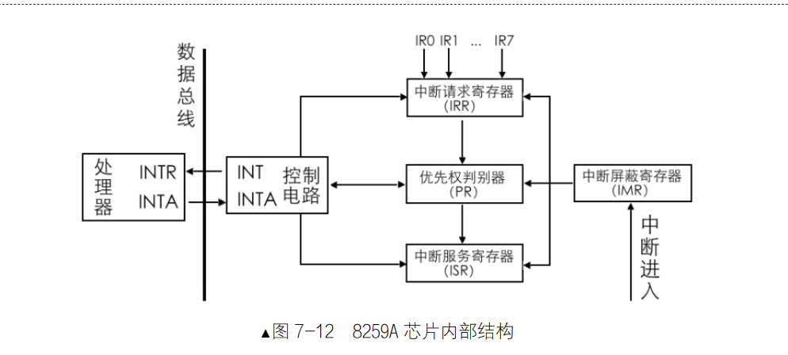

INT：8259A选出优先级最高的中断请求后，发信号通知CPU  
INTA：INT Ackonwledge，中断响应信号。接受来自CPU的INTA接口的中断响应信号  
IMR：Interrupt Mask Register，中断屏蔽寄存器，宽度8位，用于屏蔽某个外设中断  
IRR：Interrupt Request Register，中断请求寄存器，宽度8位，维护未处理的中断信号队列  
PR：Priority Resolver，优先级仲裁器，多个中断发生或新中断请求进来，将与它和当前正在处理的中断比较，找出优先级更高的中断  
ISR：In-Service Register，中断服务寄存器，宽度8位，保存正在处理的中断  

工作流程

1. 当外设发出中断信号，首先检查IMR中的位是否屏蔽，若为1则屏蔽，否则中断放行进入IRR。
2. PR从IRR中选出优先级最大的中断，IRQ接口号越低，优先级越大
3. 通过INT接口向CPU发送INTR信号
4. CPU通过INTA接口发送中断响应信号，8259A收到后，将该中断在ISR寄存器对应的BIT位置1，并将IRR中对应位置0
5. CPU再次发送INTA信号，获取中断向量号，使用起始中断向量号+IRQ接口号便是该设备的中断向量号，发送给CPU
6. CPU执行中断处理程序
7. 如果8259A的EOI通知（End Of Interrupt）被设置为手工模式，中断处理程序结束时必须向8259A发送EOI代码，8259A在收到EOI后，将当前正在处理的中断在ISR对应BIT置0。如果为自动模式，在CPU向8259A要中断向量号时，ISR中对应的BIT就为0
8. 如果此时来了IRQ低的，原先ISR上处理的旧中断的BIT清0，IRR的BIT恢复为1，随后ISR将新的BIT置0，然后将此中断向量号发给CPU

### 8259A编程
8259A上IRQ的接口号固定，但对应的中断向量号不固定。  
在8259A内部有两组寄存器，一组是初始化命令寄存器，用于保存初始化命令字（Initialization Command Words，ICW），ICW共4个。另一组为操作命令寄存器（Opertation Command Word，OCW），OCW共3个。因此8259A编程分为初始化和操作两步。

+ 在初始化中，确定是否需要级联，设置起始中断向量号，设置中断结束模式。写入顺序按照ICW1~4。
+ 控制用于中断屏蔽和中断结束。OCW顺序不固定

#### ICW1

ICW1用于初始化8259A的连接方式和中断信号触发方式。连接方式：单片or级联。触发方式：电平or边沿  
ICW1写入到主片的0x20端口和从片的0xA0端口。

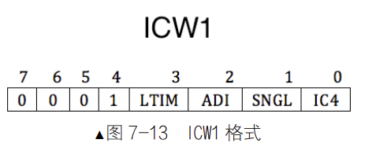

IC4表示是否需要写入ICW4，IC4为1表示需要，x86必须为1  
SNGL为1表示单片，0为级联。当为0，主片和从片需要ICW3  
ADI没用  
LTIM表示level triggered mode，设置中断检测方式，0表示边沿，1表示电平  
剩下为固定位  

#### ICW2
ICW2用于设置起始中断向量号，这里设置IRQ0映射的中断向量号
ICW1写入到主片的0x21端口和从片的0xA1端口。

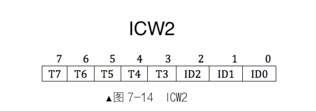

只有高5位使用。若设置ICW2=08H，则IR0～IR7请求对应的中断类型码分别为：08H、09H、0AH、0BH、0CH、0DH、0EH、0FH

#### ICW3
ICW3仅在级联方式下需要，用于设置主片和从片哪个IRQ接口互连。  
ICW3需要写入主片的0x21及从片的0xA1端口

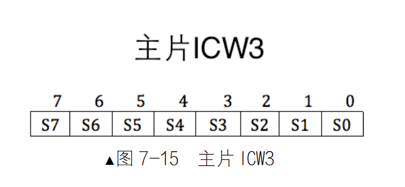

ICW3置1的位为对应的IRQ接口用于连接从片，若为0表示连接外部设备。

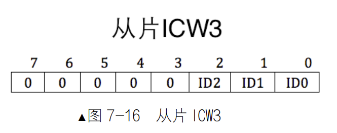

从片低3位决定连接了主片哪个IRQ

#### ICW4

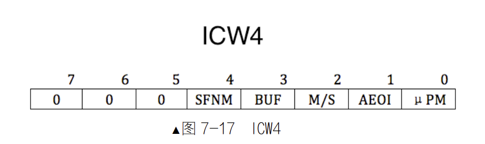

SFNM（Special Fully Nested Mode）特殊全嵌套模式，若为0，表示全嵌套模式，若为1，表示特殊全嵌套模式。  
BUF表示本8259A是否工作在缓冲模式。若BUF为0，非缓冲模式。  
M/S在非缓冲模式无效，在缓冲模式下，若M/S为1表示是主片，为0表示从片。  
AEOI表示（Auto End Of Interrupt）自动结束中断，若AEOI为0表示非自动，需要手动向8259A的主、从片发送EOI信号。  
μPM表示微处理器类型，为0表示8080或8085，1表示x86

#### OCW1

OCW1用于屏蔽中断信号，但若IF为0，则全部屏蔽。  
OCW1写入主片的0x21或从片的0xA1端口。  

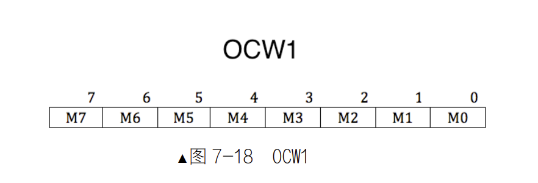

M0~M7对应IRQ0~IRQ7，若为1表示屏蔽

#### OCW2

OCW2用于设置中断结束方式和优先级模式

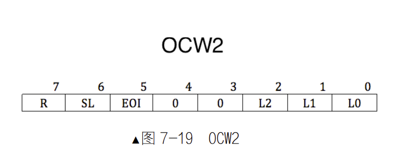

SL指定优先等级，如果SL为1，L2~L0指定位于ISR寄存器的哪一个中断被终止，结束来自哪个IRQ接口的中断信号。为0，则L2~L0不起作用，8259A自动将中断结束。  
R为0，表示固定优先级方式，IRQ接口号越低，优先级越高。  
R为1表示循环优先级，如果SL为0，初始的优先级次序为IR0>IR1>IR2>IR3>IR4>IR5>IR6>IR7。当该级别中断处理完，优先级将变成最低，将最高优先级传给较之低一级的。若此时SL为1，利用L2~L1指定最低优先级。  
EOI，中断结束命令位，若EOI为1，会将ISR寄存器相应位清0。如果中断来自主片，只需向主片发送EOI，如果中断来自从片，除了向从片发送，还得向主片发送。

#### OCW3

OCW3用于设定特殊屏蔽方式和查询方式
OCW1写入主片的0x20或从片的0xA0端口。

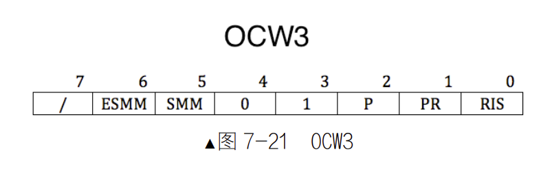

ESMM和SMM组合，用于启用或禁用特殊屏蔽模式。ESMM是特殊屏蔽模式允许位。SMM是特殊屏蔽模式位。ESMM为0，SMM无效。ESMM为1，SMM为0表示未工作在特殊屏蔽模式。若ESMM和SMM都为1，正式在特殊屏蔽模式下工作。  
P，Poll command，查询命令，P=1，设置中断查询方式。  
RR，Read Register，读取寄存器命令。当RR=1时才能读取寄存器。  
RIS，Read Interrupt register Select，读取中断寄存器选择位，若为1选择ISR寄存器，为0选择IRR寄存器。只有在RR=1才能进行上述操作。  

ICW1 和 OCW2、OCW3 是用偶地址端口 0x20（主片）或 0xA0（从片）写入。  
ICW2～ICW4 和 OCW1 是用奇地址端口 0x21（主片）或 0xA1（从片）写入。  
区分方式：ICW要按顺序写入，OCW按照第3~4位区分

---

### 编写中断处理程序
基本流程  
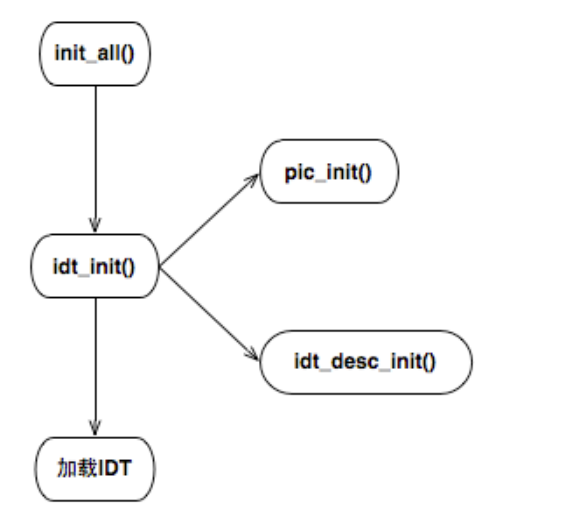

init用于初始化所有设备和数据结构，idt_init用于初始化中断，pic_init用于初始化8259A，ide_desc_init用于初始化中断描述符表

汇编宏的使用
```x86asm
%macro 宏名字参数个数

    宏代码

%endmacro

%macro mul_add 3
mov eax,%1
add eax,%2
add eax,%3
%endmacro 
```
调用上述mul_add 45，24，33，其中%1是45，%2是23，%3是33  
见代码**001/kernel/kernel.S**  

+ 由于一些中断向量号有错误码，因此对于没有错误码的需要压入一个代替的0  
+ 在中断结束时，如果从片进入了中断，要向从片和主片都发送EOI（0x20）  

见代码**001/lib/kernel/io.h**  

+ 使用内联inline和static（凡是包含io.h都能获得一份拷贝）提升代码运行效率  
+ 在重复指令的内联汇编中+的含义既作输入，又作输出，当作为es:di缓冲区时，di被当作输入。当执行rep，di+2，被当作输出。对于ecx在每次要判断是否位0，这时作为输出，当执行完后要-1，被当作输出

见代码**001/kernel/interrupt.c**  

+ 初始化中断描述符表，一共有33个中断
+ 由于0~31中断向量号已被占用，因此从0x20设置起始中断向量号

---
### 改进中断程序 
见代码**002/kernel/interrupt.c**  
使用C语言编写中断处理程序 
由于使用了C程序，在kernel.S中要保存所有的寄存器
### 调试中断程序
show int用于查看执行多少条指令后，发生中断，以及中断类型。  
sb表示以当前指令为准，再执行多少条指令停下。  
sba表示从处理器加电后，执行了多少条指令停下


### 可编程计数器8253
计算机时钟分为内部时钟和外部时钟，其中内部时钟固定无法改变，外部时钟用于CPU和外部设备同步通信。  
8253使用倒计时计数  
8253结构和计数器结构
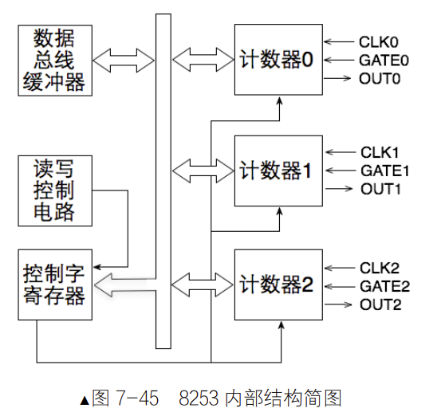

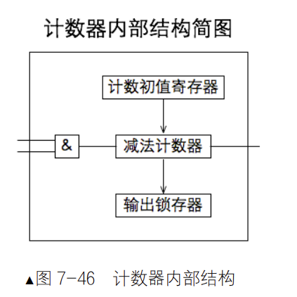

常用的是计数器0，端口号为0x40  
计数初值寄存器用于存储初始大小，16位宽  
减法计数器用于每过一定时间减值，初值寄存器的值不会变  
输出锁存器用于存储当前的值  
控制字寄存器，8位宽，端口号为0x43，用于指定计数器的模式
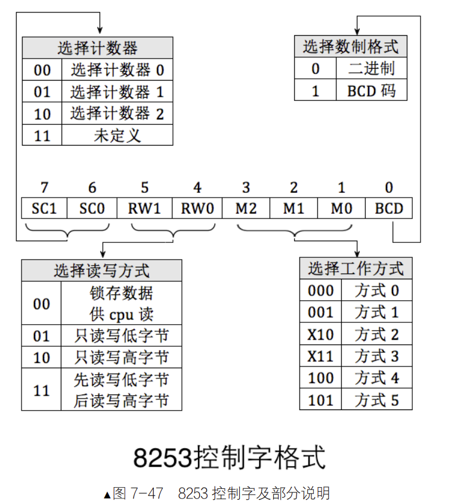

工作方式


计数器启动需要两个条件：

+ GATE 为高电平，即 GATE 为 1，这是由硬件来控制的。
+ 计数初值已写入计数器中的减法计数器，这是由软件 out 指令控制的

根据哪个条件没有满足分为，软件启动和硬件启动。  
当条件1满足时，工作方式0、2、3、4就是软件启动  
当条件2满足时，工作方式1、5就是硬件启动

计数器停止分为强制终止和自动终止

+ 强制终止将GATE变为0，2和3是循环计数
+ 工作方式0、1、4、5只单轮计数  

具体如下
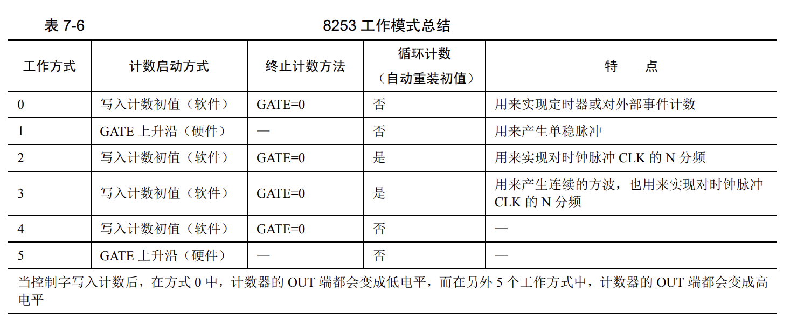

时钟中断信号产生原理：计数器频率为1.19318MHz，一秒产生1193180次脉冲，每发生一次脉冲，计数器数值减1，当计数值=0，通过out引脚发出中断信号。默认情况下，计数值为0，即65536。所以1s内发出信号次数为1193180/65536，约为18.206次。1s内发出18.206次中断，那么相当于55ms发生1次中断。  
通过改变初值，就能改变时钟频率  
8253初始化步骤：

1. 往控制寄存器端口0x43写入控制字。
2. 在所指定的计数器端口写入初值。

---
### 提高中断频率
见代码**003/timer.c**  
