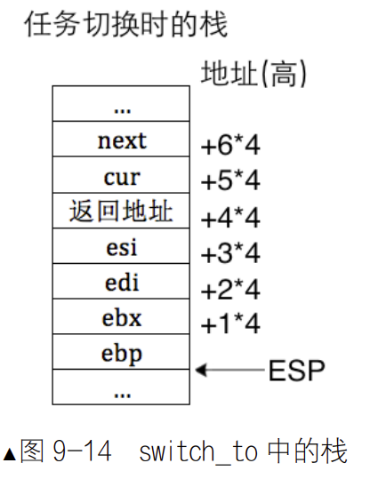

## 线程
例子见代码**001**  
任何代码块都可以独立运行，只要满足它所依赖的上下文环境，使之成为执行流，即调度单元。  
因此处理器不是把线程中调用的函数和其他指令混在一起执行，而是准备好上下文后专门执行此函数。  
利用上一点可以给进程提速，当任务A有3个线程，B有1个线程，那么在调度时有3个执行流属于A，那么A会比B多执行3次。  
进程和线程简单区别：进程是一种控制流集合，集合中至少包含一条执行流，执行流之间相互独立，但共享进程资源，执行流就是线程。  
按照线程数量：

+ 单线程进程：如果程序未显示创建线程，那么是单线程进程
+ 多线程进程：上段的反例  

**只有线程才具备能动性，它才是处理器的执行单元，因此它是调度器眼中的调度单位。进程只是个资源整合体，它将进程中所有线程运行时用到资源收集在一起，供进程中的所有线程使用，真正上处理器上运行的其实都叫线程，进程中的线程才是一个个的执行实体、执行流，因此，经调度器送上处理器执行的程序都是线程。**

实现线程的两种方式：

+ 内核进程：OS原生支持，用户进程通过系统调用使用线程
    
    + 优点：能提速，同上，线程阻塞，能让出其他进程中的线程
    + 缺点：要保护现场
+ 用户进程：OS不支持，用户自己创建。
    
    + 优点：用户自己调度线程，将线程的寄存器装载到CPU，可以在用户空间完成，不用陷入内核态。
    + 缺点：OS调度的是整个进程，线程出现了阻塞，那么整个进程都会被挂起，只能开发人员手动让出处理器。

### 内核空间线程实现
见代码**002/thread/thread.***  
函数指针复习：见[函数指针](https://blog.csdn.net/qll125596718/article/details/6891881)
```C
char (*pFun)(int);//该函数指针接收一个int，返回char
char glFun(int a){return;}//形式同上面的函数指针一样
void main()
{
    //函数名指向该函数的代码在内存中的首地址
    pFun = glFun;//将该函数的地址赋值给函数指针
    (*pFun)(2);
}
```
typedef使用更加方便
```C
typedef char (*PTRFUN)(int); //定义了一种PTRFUN的类型
PTRFUN pFun; 
char glFun(int a){ return;} 
void main() 
{ 
    pFun = glFun; 
    (*pFun)(2); 
} 
```


```C
uint32_t ebp;
uint32_t ebx;
uint32_t edi;
uint32_t esi;
```
保存以上四个寄存器原因：

+ ABI（Application Binary Interface，即应用程序二进制接口），编译方面的规定，如参数如何传递，返回值如何存储。当OS和应用程序遵循同一套ABI，编译好的应用程序可以无需修改就直接在另一套OS上运行。
+ SysV_ABI_386-V4中规定，Intel386的寄存器具有全局性，因此函数调用时，这些寄存器对主调函数和被调函数均可见。其中ebp，ebx，edi，esi和esp归主调函数使用，其余归被调函数使用。换句话说，不管被调函数是否使用了这5个，执行完后，这5个寄存器值不变。所以，被调函数要在自己的栈中存储这些寄存器。esp的值由调用约定保证
+ 如果自己手动写汇编函数，并且此函数要被C语言调用，那么要按照ABI规则编写汇编，因此后面会用汇编实现一个函数，并用C语言调用  

执行的被调用者是**kernel_thread**函数，调用情况如下：
```C
kernel_thread(thread_func* func, void* func_arg) {
    func(func_arg);
} 
```
此时的栈帧情况如下：  


因此栈顶+4为function，栈顶+8为func_arg。注意：kernel_thread不会使用这种传参的方式调用，因此在代码中只能手动将参数放入栈中。  
为了满足C语言的调用形式，当前栈顶在call后必须是返回地址，所以unused_ret用于占位置，其值充当返回地址，但将来不需要这个返回地址。这样就能在栈顶+4找到function，栈顶+8找到func_arg。  
真正的返回地址会有调度函数switch_to提供  

中断栈 intr_stack 和线程栈 thread_stack 都位于线程的内核栈中，也就是都位于 PCB 的高地址处，其中self_kstack表示内核栈指针。  
无论是进程或线程的 PCB，这都是给内核调度器使用的结构，属于内核管理的数据，因此将来用户进程的 PCB 也依然要从内核物理内存池中申请。  
中断栈的目的：

+ 线程进入中断后，kernel.S的中断代码通过此栈保存上下文。
+ 实现用户进程时，将用户进程的初始信息保存在中断栈。

```C
asm volatile ("movl %0, %%esp; pop %%ebp; pop %%ebx; pop %%edi; pop %%esi; ret" : : "g" (thread->self_kstack) : "memory");
```

解释：esp此时指向线程栈的最低处，这是由**thread_create**设定的，接下里进行4次弹栈操作，此时刚好指向thread_stack中的eip（记得从上往下看）

### 双向链表
见代码**003**   
和数据结构一样，这里没有使用data，只有指针。通过指针将每一个PCB串联起来

---

### 多线程调度
见代码**004/thread/**  
一共创建了两个队列：

+ 就绪队列：用于存储刚创建的线程
+ 全部线程队列：存储所有线程

任务调度基于时钟中断，因此在调度时要保证开中断。  
优先级多大，总的运行时间就有多长  
`elem2entry`实现转换有两种方式：

+ PCB 是在自然页的起始地址，也就是 PCB 的地址=0xfffff000&(&(PCB.general_tag))
+ 用x_tag的地址减去它们在PCB中的偏移量（使用第2种方法）
    
    1. 用结构体成员的地址减去成员在结构体中的偏移量，先获取到结构体起始地址。
    2. 再通过强制类型转换将第 1 步中的地址转换成结构体类型

任务切换必须是发生上下文资源变化，而从用户态转向内核态（内核陷入）并未发生这种变化，所以不能称之为任务切换。
任务代码有用户代码和内核代码，因此要保护两个部分的上下文。
上下文保护有两部分：

+ 上下文保护的第一部分负责保存任务进入中断前的全部寄存器，目的是能让任务恢复到中断前。（已经在kernel.S中实现）
+ 上下文保护的第二部分负责保存这 4 个寄存器：esi、edi、ebx 和 ebp（ABI），目的是让任务恢复执行在任务切换发生时剩下尚未执行的内核代码，保证顺利走到退出中断的出口，利用第一部分保护的寄存器环境彻底恢复任务。

进入`switch`函数

